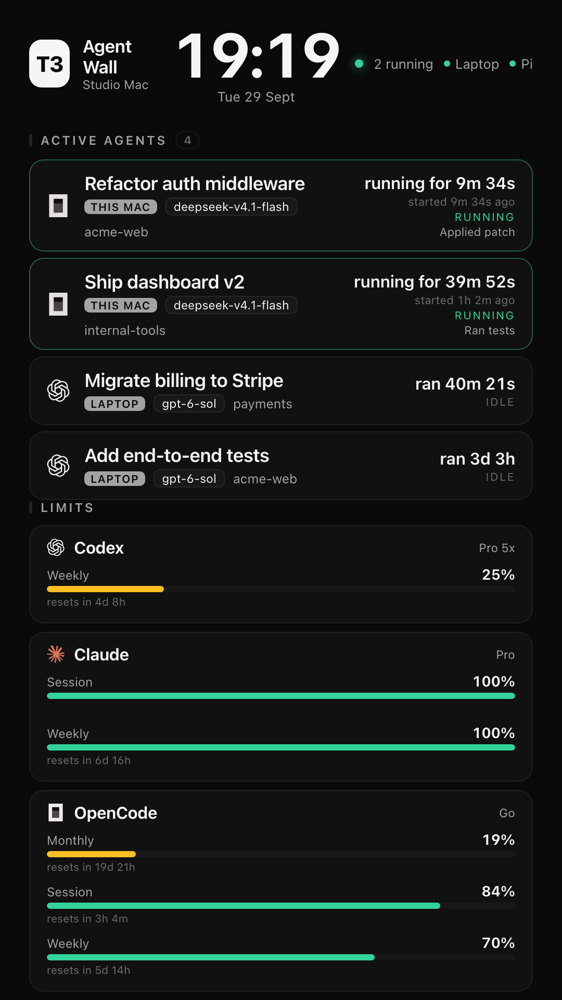

# t3-wall

[](https://github.com/RealSid08/t3-wall/actions/workflows/ci.yml)
[](./LICENSE)
[](https://bun.sh)

A read-only ambient dashboard for **[T3 Code](https://t3.codes)** — built *around* T3 Code, never
inside it. It shows your running agents, subscription limits, combined usage, and settled threads,
full-screen on a spare (portrait) display.

It does **not** modify T3 Code, restart its server, or change any settings. It reads T3's on-disk
projections and usage history `read-only`, and shells out to [`openusage`](https://openusage.app)
for subscription limits.

```
┌────────────────────────────────┐
│  14:51  3 running   ● M5  ● Pi  │  clock + live status + peer health
│ ACTIVE AGENTS                   │
│   Implement Goals v2 Backend    │  machine · model · project
│   running for 8m 4s             │  live run duration
│   started 1d 20h ago            │  thread's initial start
│ LIMITS                          │
│   Codex    Weekly 38%           │  pooled subscription windows (openusage)
│   OpenCode Go monthly/session   │
│ USAGE                           │
│   $29.50 / $901 / $2,423        │  24h / 7d / 30d, combined across machines
│   M5 $1,881 · This Mac $542     │  per-machine split (30d)
│ SETTLED                         │
│   finished threads              │
└────────────────────────────────┘
```



## Quick start

```sh
./start-server.sh            # serves http://127.0.0.1:4123
open http://127.0.0.1:4123   # check it out
```

Kiosk on a second display (fullscreen Chrome/Chromium, isolated profile):

```sh
./kiosk.sh                          # display index 1, auto-sizes to that display
T3_WALL_DISPLAY_INDEX=2 ./kiosk.sh
```

Run at login (macOS launchd; installs a server agent + a kiosk agent):

```sh
./install.sh
# stop / restart:
launchctl kickstart -k gui/$(id -u)/com.t3wall.server
launchctl bootout gui/$(id -u)/com.t3wall.kiosk   # frees the display
```

Keep the panel awake with `sudo pmset -a displaysleep 0`; launchd gives a minimal `PATH`, which
`start-server.sh` handles.

## Requirements

- [Bun](https://bun.sh) (the server) and Python 3 with `sqlite3` (peer queries) — both standard on macOS.
- [T3 Code](https://t3.codes) installed and used at least once (so `~/.t3/userdata/state.sqlite` exists).
- [`openusage`](https://openusage.app) CLI for subscription limits (`/usr/local/bin/openusage`).
- A browser for the kiosk (Chrome/Chromium; override with `T3_WALL_CHROME`).

Optional, for the cross-machine features:

- **Peer machines** reachable non-interactively over SSH (see `T3_WALL_PEERS`).
- **OpenUsage iCloud Sync** enabled, so each Mac's daily cost/tokens land in the shared container.

## Configuration (env vars)

| Var | Default | Purpose |
| --- | --- | --- |
| `T3_WALL_PORT` | `4123` | HTTP port |
| `T3_WALL_HOST` | `127.0.0.1` | Bind host |
| `T3_WALL_T3_HOME` | `~/.t3` | T3 Code home to read (`~/.t3-service` for the background service) |
| `T3_WALL_LABEL` | hostname | Header label |
| `T3_WALL_LOCAL_LABEL` | `This Mac` | Machine tag on local agents |
| `T3_WALL_PEERS` | `m5:M5,pi:Pi` | Peer T3 machines over SSH (`host:Label`, comma-separated) |
| `T3_WALL_OPENUSAGE_HISTORY` | iCloud OpenUsage `History/v1` | Combined usage source |
| `T3_WALL_OPENUSAGE` | `openusage` | Path to the openusage CLI |
| `T3_WALL_URL` | `http://127.0.0.1:4123/` | URL the kiosk opens |
| `T3_WALL_DISPLAY_INDEX` | `1` | Display index the kiosk targets |
| `T3_WALL_PROFILE` | `~/.t3-wall/chrome-profile` | Isolated browser profile for the kiosk |
| `T3_WALL_CHROME` | auto-detected | Browser binary for the kiosk |

## How it works (all read-only)

- **Agents / settled threads** — the `projection_*` tables in
  `~/.t3/userdata/state.sqlite`, opened read-only (`bun:sqlite`, `readonly: true`) while T3 keeps
  writing its WAL. Each **peer machine** is queried over SSH with the same projection query via
  `python3`, returned as JSON, cached 15s, multiplexed with SSH `ControlMaster`, and guarded by an
  8s kill timeout so an unreachable machine never blocks the page.
- **Usage (24h / 7d / 30d)** — **OpenUsage's iCloud history**
  (`~/Library/Mobile Documents/iCloud~com~robinebers~openusage/OpenUsage/History/v1/*.json`). Each
  Mac writes one file with its daily cost + tokens; summing them is what makes the number
  **combined across all machines**. Falls back to this Mac's T3 scan cache if the history is absent.
- **Subscription limits** — the `openusage` CLI, which reports Codex, Claude, OpenCode Go, Copilot,
  etc. as JSON. Because limits come from `openusage`, **OpenCode Go session/weekly/monthly** shows
  even on T3 Code builds that predate the in-app OpenCode limits card.

Nothing here is ever written to T3 Code, its database, or any peer. The only new state is the wall's
own `~/.t3-wall/` (browser profile, logs).

## Peers (other machines)

Cross-machine data uses plain **SSH** rather than T3 Connect: it's already how these boxes are linked
(key-based, unattended), it needs no extra daemon or cloud hop, and the read is a single short query.
Configure it with `T3_WALL_PEERS`:

```sh
T3_WALL_PEERS="m5:M5,mbp:MacBook Pro" ./start-server.sh
```

Each host needs to be reachable non-interactively (`ssh -o BatchMode=yes <host>`), have a T3 home at
`~/.t3`, and `python3` (with the `sqlite3` module) on its `PATH`. Peer state is cached for 15s and SSH
connections are multiplexed (`ControlMaster`); an unreachable peer just shows **offline** in the header
and never blocks the page.

A nicer future option would be reading peers through T3 Connect's relay API with a scoped token — if
you build that, keep SSH around as the zero-config fallback.

## Notes / limits

- The account-level subscription **limits** come from `openusage`; the cross-machine **cost/tokens**
  come from OpenUsage's iCloud history (daily granularity).
- If a peer is unreachable it shows offline (`T3_WALL_PEERS`) and its agents simply drop out.
- "running" and the elapsed times are exactly what T3 reports; a wedged session can look "running"
  until T3 settles it.

## Troubleshooting

- **The kiosk panel goes black after a while and a power-cycle brings it back.** Some monitors ship
  a 165 Hz mode that is really an *overclock*; when it drifts the panel drops signal until it
  re-syncs. Pin the panel to its stable native rate (e.g. 144 Hz) with
  [`displayplacer`](https://github.com/jakehilborn/displayplacer):
  `displayplacer "id:<screenId> res:1080x1920 hz:144 ..."`. A small `launchd` job that re-applies
  the rate whenever it drifts keeps it lit hands-free.
- **The display sleeps anyway.** `pmset -a displaysleep 0` ("Never" in Lock Screen settings) plus a
  `caffeinate -dimsu` process is the belt-and-braces pair.
- **A peer shows offline.** Confirm `ssh -o BatchMode=yes <host>` works from the wall's user; the
  wall only ever runs a short read-only query there.
- **Numbers look stale.** Every source is cached for 15–60 s on purpose so an unreachable peer or a
  slow `openusage` call can never stall the page.

## Contributing

Issues and pull requests are welcome. Please read [`CONTRIBUTING.md`](./CONTRIBUTING.md); the one
hard rule is that t3-wall stays **read-only** and never modifies T3 Code. This project follows the
[Contributor Covenant](./CODE_OF_CONDUCT.md). For security reports, see [`SECURITY.md`](./SECURITY.md).

## Credits

- Provider marks under [`public/icons.js`](./public/icons.js) are from
  [T3 Code](https://github.com/pingdotgg/t3code) (MIT).
- Subscription-quota data via [OpenUsage](https://openusage.app).

## License

[MIT](./LICENSE) © Sidhaarth Krishnan
